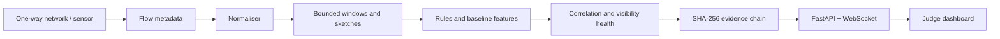

# SENTINEL-X 🛡️📡

> **Detect the attack. Prove the monitor stayed silent. Explain every alert.**

**Passive, read-only network threat detection for one-way and data-diode monitored
networks.** SENTINEL-X observes flow metadata, detects suspicious behavior,
measures capture visibility, and preserves tamper-evident evidence—without
inspecting payloads, decrypting sessions, or sending traffic back into the
protected network.

[](https://github.com/Aaryan2R/SENTINEL-X/actions/workflows/ci.yml)
[](https://www.python.org/)
[](https://react.dev/)
[](docs/SIH_SUBMISSION.md)

> **Important scope note:** The current checked-in experience is a reliable,
> offline **software-emulated passive monitoring demo**. It uses in-memory
> state by default. Linux can expose measured interface TX counters; Windows
> deliberately displays `PASSIVITY EMULATED` rather than claiming a hardware
> data diode. PostgreSQL durability, Redis worker deployment, host enforcement,
> signed model bundles, and hardware guarantees remain production hardening.

---

## ✨ Why SENTINEL-X stands out

| Capability | What a judge can verify |
| --- | --- |
| **Receive-only by design** | The engine consumes flow metadata only; it does not send probes or inspect payloads. |
| **Passivity evidence** | Linux TX counters can be measured around a replay; unavailable environments are labelled as emulated. |
| **Visibility-aware confidence** | Capture loss, interface drops, sequence gaps, queue lag, and shedding state affect health and confidence. |
| **Explainable detections** | Alerts show detector, confidence, ATT&CK technique, evidence, contributions, and window. |
| **Tamper-evident history** | SHA-256 `evidence_hash` and `prev_hash` links can be recomputed with one click. |
| **Reproducible evaluation** | Seeded benign, port-scan, and SYN-flood scenarios have predictable expected outcomes. |
| **Responsible real-data path** | Authorized flow CSVs can be provenance-recorded, trained offline, and replayed as metadata without committing restricted data. |

## 🎬 The 90-second demo

1. Start the one-command launcher and open the dashboard.
2. Show the passivity state and explain why Windows is explicitly emulated.
3. Replay `normal`: **zero alerts**.
4. Click **RESET DEMO**, replay `port_scan`: show `PORT_SCAN`, confidence,
   detector version, `T1046`, evidence, and hash fields.
5. Replay `syn_flood`: show a distinct flood detector and explanation.
6. Click **VERIFY CHAIN**: show `EVIDENCE CHAIN VALID`.
7. Open the evaluation report to show counts, coverage, false-positive status,
   measured latency, Python version, platform, and seed.

See the complete judge sequence in
[`docs/JUDGE_BRIEF.md`](docs/JUDGE_BRIEF.md).

---

## 🧠 What is implemented

### Detection and evidence

- Metadata-only detectors for port scans, SYN floods, volumetric behavior, and
  DGA-like DNS signals.
- Bounded event-time windows, late-event accounting, sketches, EWMA/CUSUM,
  batching, shard ownership, acknowledgements, and dead-letter isolation.
- Signal correlation, deduplication, visibility-health confidence adjustment,
  ATT&CK mapping, and SHA-256 evidence chaining.
- FastAPI endpoints for health, flows, alerts, alert detail, stats, incidents,
  samples, reset, visibility injection, evidence verification, and WebSocket
  live updates.

### Dashboard

- Live flow stream and alert list.
- Reset control for repeatable judging.
- Passivity and visibility-health strip.
- Alert evidence panel with confidence, detector, ATT&CK technique,
  contributions, `evidence_hash`, and `prev_hash`.
- One-click evidence-chain verification with first-failure diagnostics.

### Training and real-flow replay foundation

- Shared metadata-only feature extraction for training and inference.
- Provenance-aware CSV loader with common CIC-style column aliases.
- Hash-checked JSON centroid baseline model.
- Offline training command and local flow-metadata replay command.
- Raw PCAPs, credentials, DGA lists, and third-party tool output remain outside
  the repository and are never silently treated as production training data.

---

## 🚀 Quick start

### Prerequisites

- Git
- Python **3.13–3.14**
- Node.js **22+** and npm
- Docker Desktop (optional; required only for the Linux-oriented service layout)
- Linux or WSL2 for kernel TX-counter proof; Windows is supported for the
  software-emulated demo

### Option A — one-command Windows demo (recommended)

From the repository root in PowerShell:

```powershell
.\scripts\demo.ps1 -InstallFrontend
```

The launcher starts the API and frontend, waits for health, and replays the
selected scenario. Use `-Scenario normal`, `-Scenario port_scan`, or
`-Scenario syn_flood`. Use `-LossRate 0.05` to demonstrate visibility loss.

Open <http://localhost:5173>.

### Option B — manual development startup

**Terminal 1 — API, from the repository root**

```powershell
$env:PYTHONPATH = "$PWD\engine"
python -m pip install fastapi uvicorn pydantic redis structlog
python -m uvicorn api.main:app --reload
```

For bash/WSL:

```bash
PYTHONPATH="$PWD/engine" python -m uvicorn api.main:app --reload
```

**Terminal 2 — dashboard**

```powershell
cd frontend
npm ci
npm run dev
```

**Terminal 3 — deterministic replay**

```powershell
python traffic\replay\demo_replay.py --scenario normal
python traffic\replay\demo_replay.py --scenario port_scan
python traffic\replay\demo_replay.py --scenario syn_flood
```

If `ModuleNotFoundError: No module named 'sentinel'` appears, run the command
from the repository root and set `PYTHONPATH` exactly as shown. The API does not
require Redis or PostgreSQL for the local demo.

### Optional Docker layout

```bash
docker compose --profile demo up --build
```

The local launcher is the supported SIH path. The sensor/netns and passivity
emulation components require Linux and are not a Windows hardware guarantee.

---

## 📊 Reproducible evaluation

With the API running, execute:

```powershell
python scripts\evaluate_demo.py --seed 42
```

The runner resets between scenarios and records flow counts, observed alerts,
true-positive status, false-positive status, coverage, p50/p95 request
latency, Python version, platform, and the exact seed in
`docs\evaluation\latest.json`. That generated file is ignored by Git because
measurements are machine-specific.

| Scenario | Expected result |
| --- | --- |
| `normal` | 20 flows, zero alerts |
| `port_scan` | 80 flows, `PORT_SCAN` observed |
| `syn_flood` | 80 flows, `SYN_FLOOD` observed |

Do not replace measured values with invented benchmark numbers. Read
[`docs/EVALUATION.md`](docs/EVALUATION.md) for loss injection and reporting
details.

### Linux passivity proof

On Linux/WSL, set the capture interface and wrap a replay:

```bash
export SENTINEL_CAPTURE_INTERFACE=eth0
python scripts/assert_tx_zero.py --interface eth0 \
  python traffic/replay/demo_replay.py \
  --scenario port_scan --api http://localhost:8000
```

The wrapper fails if interface TX packets change. On Windows, the dashboard
correctly reports emulation instead.

### Evidence-chain verification

While the API is running:

```text
GET http://localhost:8000/api/evidence/verify
```

Or click **VERIFY CHAIN** in the dashboard. The verifier recomputes each
canonical evidence hash, checks every predecessor link, and reports the first
failed alert rather than silently accepting tampered evidence.

---

## 🧪 Authorized real-data workflow

SENTINEL-X can use real data **only when it was lawfully acquired and reduced
to flow metadata outside this repository**. The current model is an offline
baseline and is not automatically connected to live alert decisions.

### Train a baseline

The CSV must contain a `label` and flow metadata. Common CIC-style names such
as `Source IP`, `Destination Port`, `Flow Duration`, `Tot Fwd Pkts`, and
`Total Length of Fwd Packets` are accepted.

```powershell
$env:PYTHONPATH = "$PWD\engine"
python scripts\train_model.py `
  --input CIC-IDS2017=C:\authorized\cic_flows.csv `
  --output datasets\models\metadata_centroid.json `
  --manifest datasets\models\manifest.json
```

The manifest records source name, row count, retrieval-independent file
checksum, and model metadata. `datasets/` is ignored by Git.

### Replay real flow metadata into the API

```powershell
python traffic\replay\replay_csv.py `
  C:\authorized\cic_flows.csv `
  --api http://localhost:8000 `
  --label CIC-IDS2017
```

This sends only flow metadata to the local API. It does not open the original
capture, inspect payloads, contact the source dataset, or launch an attack
tool.

### Source registry

The recommended lab and benchmark sources are documented with official links,
provenance rules, and licensing cautions in
[`docs/DATASETS.md`](docs/DATASETS.md):

- Benign: iperf3, Ostinato, TRex.
- Lab validation: hping3, Slowloris, dnscat2, iodine.
- DGA research: account-controlled DGArchive.
- Public benchmark context: CIC-IDS2017, CTU-13, UNSW-NB15.

Never run stress or tunnelling tools outside an authorized isolated lab. Do not
commit raw PCAPs, restricted DGA lists, credentials, or tool output.

---

## 🏗️ Architecture



```text
SENTINEL-X/
├── api/                    FastAPI API, passivity reporting, WebSocket
├── engine/
│   ├── sentinel/common/    Flow, signal, alert contracts
│   ├── sentinel/detector/  Detection rules and async worker
│   ├── sentinel/features/  Windows, sketches, shared training features
│   ├── sentinel/correlator/Correlation and evidence verification
│   ├── sentinel/monitor/   Passivity and visibility health
│   └── tests/              Engine and integrity tests
├── frontend/               React + TypeScript + Vite dashboard
├── traffic/                Synthetic generator and metadata replayers
├── scripts/                Demo, evaluation, TX proof, and training CLIs
├── migrations/             Optional PostgreSQL schema
├── infra/                  Linux namespace, nftables, and tc scaffolding
├── docs/                   Submission, evaluation, datasets, and architecture
└── task.md                 Authoritative phased implementation status
```

### Data boundary

```text
Allowed: flow metadata, timestamps, addresses, ports, protocol, bytes,
         packets, connection state, DNS/TLS metadata where available.

Not inspected: payload contents, decrypted sessions, credentials, raw secrets.
Not performed: active probing, response traffic, automatic attack generation.
```

---

## 🛠️ Development and verification

### Engine

```powershell
cd engine
uv sync
uv run ruff check .
uv run mypy .
uv run pytest
```

### Frontend

```powershell
cd frontend
npm ci
npm run build
npm run lint
```

The expected engine suite currently contains 43 tests. Frontend lint may report
the existing React `set-state-in-effect` warning; TypeScript compilation and
the production Vite build must pass.

---

## 🗺️ Roadmap and honest status

| Track | Status |
| --- | --- |
| Phase 0 contracts, demo foundation, documentation | Complete |
| Phase 1 local detection demo and dashboard | Complete |
| Visibility, passivity reporting, loss injection, evidence verification | Complete for local/demo scope |
| Shared metadata features and CSV baseline training | Implemented foundation |
| Calibrated Isolation Forest / Random Forest / XGBoost scoring | Planned |
| Live model activation, signed bundles, rollback | Planned hardening |
| Full Zeek capture-loss integration and durable shed records | Partial/planned |
| Cross-dataset precision/recall and benchmark report | Planned |
| Hardware data-diode guarantee | Deployment responsibility, not claimed by this repo |

[`task.md`](task.md) is the authoritative checklist. The project deliberately
labels partial and production-only work instead of presenting roadmap items as
finished features.

---

## 📚 Documentation

- [`docs/SIH_SUBMISSION.md`](docs/SIH_SUBMISSION.md) — verified submission
  story, safe claims, and limitations.
- [`docs/JUDGE_BRIEF.md`](docs/JUDGE_BRIEF.md) — pitch and live judge sequence.
- [`docs/EVALUATION.md`](docs/EVALUATION.md) — measured scenarios and TX proof.
- [`docs/DATASETS.md`](docs/DATASETS.md) — source registry, provenance, and
  safe ingestion policy.
- [`architecture.md`](architecture.md) — system architecture.
- [`rules.md`](rules.md) — project invariants and engineering rules.
- [`task.md`](task.md) — phased delivery status.
- [`memory.md`](memory.md) — persistent project decisions.

## 🤝 Contribution expectations

1. Preserve the receive-only boundary.
2. Keep deterministic regression scenarios passing.
3. Never add raw restricted datasets, credentials, or unsigned model artefacts.
4. Add tests and provenance whenever a detector or data source changes.
5. Report measured results; never invent performance or accuracy numbers.

## 📄 License

The repository license is **not yet determined**. Third-party tools and
datasets listed in [`docs/DATASETS.md`](docs/DATASETS.md) retain their own
licenses and terms. Review provenance and redistribution rights before using
any external data in a submission or deployment.
